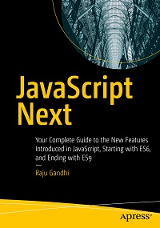

# Apress Source Code

This repository accompanies [*JavaScript Next*](http://www.apress.com/9781484253939) by Raju Gandhi (Apress, 2019).

[comment]: #cover


Download the files as a zip using the green button, or clone the repository to your machine using Git.

## Releases

Release v1.0 corresponds to the code in the published book, without corrections or updates.

## Contributions

See the file Contributing.md for more information on how you can contribute to this repository.

## Built With

* [Babel](https://babeljs.io/)
* [Chai](https://www.chaijs.com/)
* [Mocha](https://mochajs.org/)
* [Sinon](https://sinonjs.org/)
* [ESLint](https://eslint.org/)

<!-- GETTING STARTED -->
## Getting Started

### Prerequisites

- [Node](https://nodejs.org/en/)
- [Yarn](https://yarnpkg.com/en/) (Preferred)

### Installation

1. Clone this repo and `cd` into the root of the project
2. Install dependencies
```sh
yarn install
```
3. Verify the code
```sh
# to run all the test
yarn run test;
# to run tests in 'watch' mode
yarn run test:watch;
```
4. Explore, experiment, and make sure the tests pass.
5. Profit!

<!-- CONTACT -->
## Contact

Raju Gandhi - [@looselytyped](https://twitter.com/looselytyped)

<!-- ACKNOWLEDGEMENTS -->
## Credits

* Many thanks to [Kriasoft](https://github.com/kriasoft) for creating [Babel Starter Kit](https://github.com/kriasoft/babel-starter-kit) and [distributing](https://github.com/kriasoft/babel-starter-kit/blob/master/LICENSE.txt) it under the MIT License
